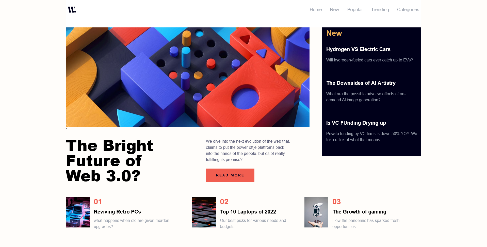

# Frontend Mentor - News homepage

Esta es una solución al [News homepage en Frontend Mentor] (https://www.frontendmentor.io/challenges/news-homepage-H6SWTa1MFl). 

## Descripción general

### El reto

Los usuarios deberían poder:

- Ver el diseño óptimo para la interfaz dependiendo del tamaño de pantalla de su dispositivo
- Ver los estados de desplazamiento y enfoque para todos los elementos interactivos en la página

### Screenshot

### Links

- URL del sitio activo: https://ejcp3.github.io/News-homepage_/

## Mi proceso

### Construido con

- Astro
- HTML5 Semántico 
- Tailwindcss
- Mobile-first
